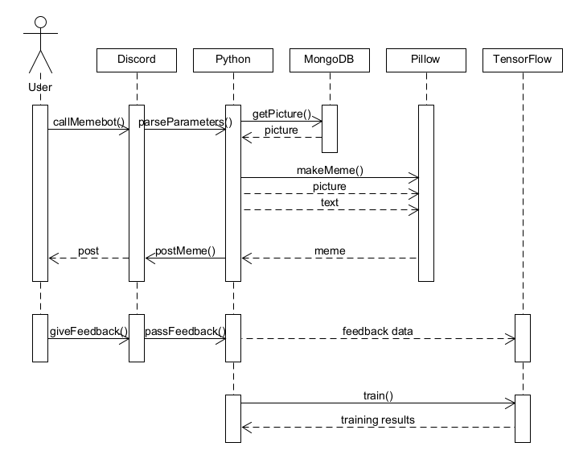

# Meme Bot Design

## Problem Statement

Memes have become a cornerstone of online culture. Namely, online meme generators allow people to quickly and easily construct memes. However, there is no quick or convenient way to do this on Discord, one of the most popular chat platforms in use today. Because Discord is such a popular place for socializing, having a fast meme generator here could provide a substantial benefit to users. 

Our “meme-bot” could also present some interesting technical applications. By design, this bot uses an _image search,_ then _automatically edits the image _to create a meme. Each of these two steps are, in themselves, important AI tasks that could streamline online work. Creating this memebot could be an opportunity to display and advance each of these two areas. (In this bot, image-searching and editing will be in the _context _of creating a meme, but using a similar approach with different data sets could adapt this bot to find images or edit them for other situations.)

## Bot Description

The bot takes in some input from a user that is related to it via a tagging system. It can take in a certain amount of strings as inputs to use them to construct a meme. The bot uses a machine learning algorithm and samples to decide which meme format and image background is best to use for the inputted text.

It then formats the meme as an image and sends it in reply to the user. It asks for a thumbs up or thumbs down reaction based on whether the user liked the meme or not. Depending on the response, it will take it as more data so as to train it’s model. This model is trained intermittently as new data is given to it (this data being an association with strings of text to images).

### Tagline
Meme bot is a meme generator like no other, harnessing the powers of automation and machine learning to make funny and interesting memes that you wish you thought of yourself!

## Use Cases

Use Case 1: Generate Meme
* 1 Preconditions
    * None.
* 2 Main Flow
    * The bot takes in some input from a user that is related to it via a tagging system. [S1] The bot decides which meme format and image background is best to use for the inputted text. [S2] It then formats the meme as an image [S3] and sends it in reply to the user. [S4]
* 3 Subflows
    * [S1] Bot reads message from user identified by a unique identifier such as a prefix followed by a command and the words to be included in the meme
    * [S2] Bot uses a machine learning algorithm and samples to choose the most appropriate image background as well as text formatting for the given input 
    * [S3] Bot formats the text and background into an image file.
    * [S4] Bot sends completed image as an attachment in response to the original message from the user
* 4 Alternative Flows
    * [E1] User inputs a single word
    * [E2] User inputs a single phrase
    * [E3] User inputs multiple, separate phases

Use Case 2: Input Reaction
* 1 Preconditions
    * Meme generated and sent in chat
* 2 Main Flow
    * User reacts to generated meme with a “thumbs up” or “thumbs down” emote. [S1] Bot collects this information [S2] and uses this feedback to train its accuracy. [S3] 
* 3 Subflows
    * [S1] User adds a reaction to message from Bot containing the generated meme with either the “thumbs up” or “thumbs down” emote. All other reactions will not be tracked.
    * [S2] Bot stores this information in a database and appends data to other performance metrics such as total upvotes and feedback per type of meme.
    * [S3] Bot uses this feedback to train its machine learning algorithm, improving its likeness to human meme generation.
* 4 Alternative Flows
    * None.

## Design Sketches

Storyboard of using the Meme Bot

Sequence diagram of the internal workings of the bot

## Architecture Design

For the levels of the above architecture, the team wants to design the system in such a way that all elements can work together effectively and efficiently. The first element of the architecture is the discord bot, which runs on a server (anything that runs node, can be a simple git firebase or other), which interacts with a separated main bot interface system within a AWS EC2 container. In this container will be a python server system that has a number of functions which involve the backend of the bot. Specifically, at this point the Python server will get existing memes from a source such as Kaggle (via API), retrieve said data, store on MongoDB and use data to train machine learning algorithms based in TensorFlow. After algorithm training is done, the actual functionality of the bot user-wise is to take in text and classify it, again using mongoDB and TensorFlow to respectively store and determine outputs. Lastly, Pillow will be used to put the output together into a meme for the user and sent back to the discord bot for posting. The discord bot will gather information about the quality of the meme from user feedback which will then be fed into the TensorFlow algorithm to improve the results of the algorithm going forwards.

It should also be noted that this architecture is not specifically bound to AWS. For development purposes it may be simpler to host the bot locally and avoid the fees and complexity associated with deploying to the cloud. This will also give us much better flexibility in the future if we decide to host our bot on a cloud provider other than AWS, since we avoided the use of any AWS specific tools that would cause platform lock-in.

We also may consider containerizing our application using a tool like Docker to aid in deploying, scaling, and testing of our services. This will be crucial if the popularity of our application grows and we need to scale our systems to handle the increased load.